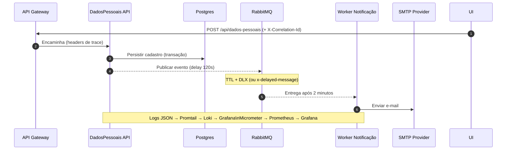

# Case Itaú — API de Dados Pessoais

API em **Java 17 + Spring Boot** que cadastra dados pessoais, persiste em **PostgreSQL** e agenda uma **notificação por e-mail após 2 minutos** via **RabbitMQ**.  
Tráfego externo via **Spring Cloud Gateway** (circuit breaker, retry e correlation-id).  
Observabilidade com **Prometheus + Grafana** (métricas) e **Loki + Promtail** (logs centralizados).

---

## 1) Fluxo principal (criar cadastro + e-mail em D+2 min)



---

## 2) Mensageria (fila com delay de 2 minutos)

**Opção A — TTL + Dead Letter Exchange (sem plugins)**  
- Exchange principal `cadastro.events` → fila `email.delay` com `x-message-ttl=120000` e `x-dead-letter-exchange=cadastro.events.dlx`.  
- Após 120s, DLX roteia para fila `email.send` consumida pelo Worker.

**Opção B — Plugin `x-delayed-message` (se habilitado)**  
- Exchange `cadastro.delayed` (tipo `x-delayed-message`) e publicar com header `x-delay=120000` roteando para a fila `email.send`.

---

## 3) Subindo o ambiente

```bash
git clone https://seu-repositorio.git
cd caseItau
docker compose up -d --build
```

**Portas externas disponíveis**
- Gateway: http://localhost:8081  
- RabbitMQ UI: http://localhost:15672  
- Prometheus: http://localhost:9090  
- Grafana: http://localhost:3000  (user: **admin**, pass: **admin**)

---

## 4) Endpoints principais

| Método | Endpoint                    | Descrição                                                     |
|-------:|-----------------------------|---------------------------------------------------------------|
|   POST | `/api/dados-pessoais`      | Cadastra novo registro e agenda e-mail após 2 min            |
|    GET | `/api/dados-pessoais`      | Lista paginada de cadastros                                  |
|    GET | `/api/dados-pessoais/{id}` | Consulta por ID                                               |
|    PUT | `/api/dados-pessoais/{id}` | Atualiza totalmente o registro                                |
|  PATCH | `/api/dados-pessoais/{id}` | Atualiza campos parciais (merge-patch)                        |
| DELETE | `/api/dados-pessoais/{id}` | Remove registro                                               |

**Convenções**
- `Content-Type: application/json; charset=utf-8`  
- `X-Correlation-Id: <uuid>` (se ausente, a API gera e retorna)  
- Erros no formato **RFC 7807** (`application/problem+json`)  
- Paginação: `page`, `size`, `sort=campo,asc|desc`

---

## 5) Exemplos de requests/responses

### POST `/api/dados-pessoais` — criar

**Body**
```json
{
  "nome": "brian",
  "sobreNome": "lucas",
  "idade": 30,
  "pais": "Brasil",
  "email": "naaa@n1.com"
} "uf": "SP"

```

### GET `/api/dados-pessoais/{id}` — consultar por ID

**200 OK**
```json
{
  "nome": "brian",
  "sobreNome": "lucas",
  "idade": 30,
  "pais": "Brasil",
  "email": "naaa@n1.com"
}
```

**404 Not Found**
```json
{
  "type": "https://api.itau.com.br/errors/not-found",
  "title": "Cadastro não encontrado",
  "status": 404,
  "detail": "Recurso id=999 não existe",
  "instance": "/api/dados-pessoais/999"
}
```

---
## 6) Estrutura do repositório

```
├── gateway/                  # Spring Cloud Gateway
├── itau/                     # API de dados pessoais
├── observability/            # Prometheus, Loki, Promtail, dashboards
├── docker-compose.yml
└── README.md                 # (este arquivo)
```
